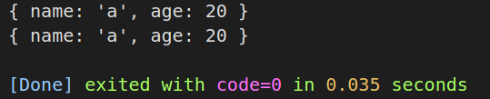
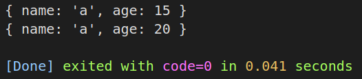
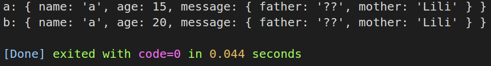
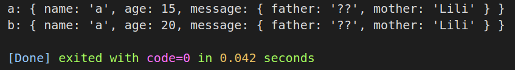
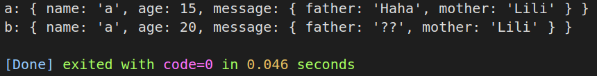
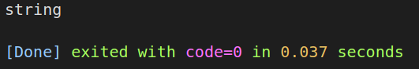
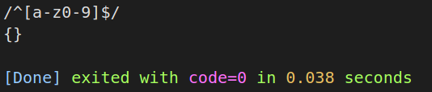
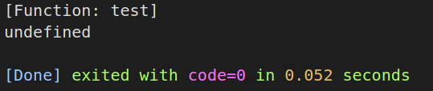
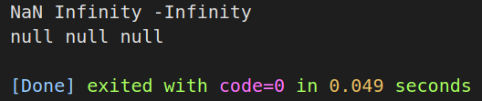

# 深浅拷贝

## 介绍

浅拷贝（shallow copy）：只复制指向某个对象的指针，而不复制对象本身，新旧对象共享一块内存；

深拷贝（deep copy）：复制并创建一个一摸一样的对象，不共享内存，修改新对象，旧对象保持不变

### 浅拷贝

#### 1. 赋值

```javascript
var a = {name:"a",age:15};
var b = a;

b.age = 20;

console.log(a);
console.log(b);
```

我们将a的值传递给了b，因为js默认浅拷贝，所以其实我们是将a的地址传递给了b。

所以我们在修改b的age时，a的age也一同更改了，因为这两个变量指向的是同一块内存空间。



#### 2. ES6解构赋值

使用解构的情况有些特殊，我们来看例子。

```javascript
var a = {name:"a",age:15};
var b = {...a};

b.age = 20;

console.log(a);
console.log(b);
```



这里我们可以看到对`b.age`的修改并没有影响a，这说明ab使用的不是一块内存空间，解构赋值是深拷贝？

我们接着修改一下代码。

```javascript
var a = {
    name: "a",
    age: 15,
    message: { father: "Haha", mother: "Lili" }
};
var b = { ...a };

b.age = 20;
b.message.father = "??";

console.log("a:", a);
console.log("b:", b);
```



这里我们将a内部新增了一个message对象，并在结构赋值后修改了`b.message.father`，结果是`a.message.father`也受到了影响，这说明此时是浅拷贝。

由这两个例子我们可以得出结论。

**也就是说，如果解构赋值源对象某个属性的值是引用类型，那么目标对象拷贝得到的是这个值的引用。所以，解构赋值是浅拷贝。**

#### 3. ES6 Object.assign()

assign()是ES6 Object新增的方法。

```javascript
var a = {
    name: "a",
    age: 15,
    message: { father: "Haha", mother: "Lili" }
};
var b = Object.assign({}, a);

b.age = 20;
b.message.father = "??";

console.log("a:", a);
console.log("b:", b);
```



**Object.assign()是浅拷贝的原因同解构赋值。**

### 深拷贝

#### 1. JSON转换

```javascript
var a = {
    name: "a",
    age: 15,
    message: { father: "Haha", mother: "Lili" }
};
var b = JSON.parse(JSON.stringify(a))

b.age = 20;
b.message.father = "??";

console.log("a:", a);
console.log("b:", b);
```



通过json转换可以达到深拷贝的目的，但是这种方法有一些需要注意的点。

**(1) 时间对象**

```js
var a = {
    date: new Date()
};
var b = JSON.parse(JSON.stringify(a))

console.log(typeof b.date, '')
```



可以看到时间对象通过`JSON.stringify()->JSON.parse()`之后变为了**字符串类型**。

**(2) 正则**

```js
var a = {
    re: new RegExp(/^[a-z0-9]$/)
};
var b = JSON.parse(JSON.stringify(a))

console.log(a.re, '')
console.log(b.re, '')
```



可以看到正则对象通过`JSON.stringify()->JSON.parse()`之后变为了**空对象**。

**(3) 函数**

```js
var a = {
    func: function test() {
        console.log('test-func', '')
    }
};
var b = JSON.parse(JSON.stringify(a))

console.log(a.func, '')
console.log(b.func, '')
```



可以看到函数通过`JSON.stringify()->JSON.parse()`之后变为了**undefined**。

**(4) NaN, Infinity**

```js
var a = {
    NaN: NaN,
    Infinity: Infinity,
    minusInfinity: -Infinity
};
var b = JSON.parse(JSON.stringify(a))

console.log(a.NaN, a.Infinity, a.minusInfinity)
console.log(b.NaN, b.Infinity, b.minusInfinity)
```



可以看到NaN, Infinity通过`JSON.stringify()->JSON.parse()`之后变为了**null**。

