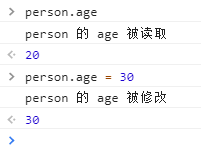

# 变化监测

## 前言

vue主要特点就是数据驱动，也是因为数据的变化，或者说状态的变化导致了页面随之发生变化。
本文章主要对vue中如何实现数据的响应式系统，从而达到数据驱动视图进行学习。

## vue中是如何知道状态发生变化了？

要研究vue数据驱动的原理，首先要知道vue是如何做到知道状态发生了变化，或者说状态发生变化是如何通知vue渲染视图的。

## Object.defineProperty

在js中，提供了Object.defineProperty方法用来检测数据变化。

> 该方法允许精确地添加或修改对象的属性。通过赋值操作添加的普通属性是可枚举的，在枚举对象属性时会被枚举到（[`for...in`](https://developer.mozilla.org/zh-CN/docs/Web/JavaScript/Reference/Statements/for...in) 或 [`Object.keys`](https://developer.mozilla.org/zh-CN/docs/Web/JavaScript/Reference/Global_Objects/Object/keys)[ ](https://developer.mozilla.org/en-US/docs/JavaScript/Reference/Global_Objects/Object/keys)方法），可以改变这些属性的值，也可以[`删除`](https://developer.mozilla.org/zh-CN/docs/Web/JavaScript/Reference/Operators/delete)这些属性。这个方法允许修改默认的额外选项（或配置）。默认情况下，使用 `Object.defineProperty()` 添加的属性值是不可修改（immutable）的。

vue中借助了Object.defineProperty来实现变化检测，所以我们这里首先来看一下Object.defineProperty是如何在实际使用中检测数据变化的

### Object的变化监测

如何实现object的数据监测

首先我们定义一个js Object 

```js
let person = {
    name : "张三",
    age : 20
}
```

这是一个基本的对象，我们可以通过 `person.属性` 直接对对象的属性进行修改。但是我们现在无法监测这个对象的属性是否遭到了修改。

这里我们就要通过Object.defineProperty对这个对象进行改写。

```js
'use strict'

let person = {
    name: "张三"
}
let age = 20

Object.defineProperty(person, "age", {
    // 可枚举
    enumerable: true,
    // 可修改，删除
    configurable: true,
    set(nVal) {
        console.log("person 的 age 被修改")
        age = nVal
    },
    get() {
        console.log("person 的 age 被读取")
        return age;
    }
})
```

这里我们通过 Object.defineProperty 为 person 定义了一个 age 属性，当我们对这个属性进行读写的时候，就会触发 get() set() 方法。



可以看到，我们对person的age属性进行读写的时候，我们收到了get 和 set 的反馈，这样我们就成功对person的age属性进行了监测。

下面我们将这对属性监测的操作进行封装，实现对一个对象所有的属性进行监测。下面代码是vue源码进行修改之后的。

源码位置 `src\core\observer\index.js`

```js

```

