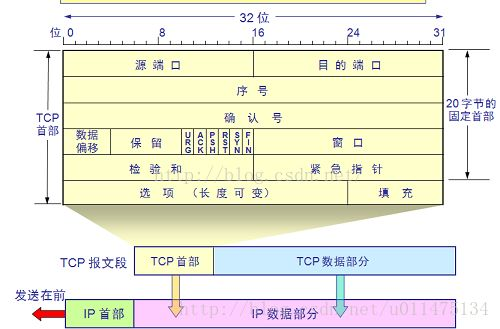

# TCP（传输控制协议）

TCP 是互联网核心协议之一，前端面试中经常会提及相关内容。

传输控制协议（TCP，Transmission Control Protocol）是一种面向连接的、可靠的、基于字节流的传输层通信协议，由IETF的RFC 793定义。

tcp是全双工通信。

## 首部格式

>* **序号（seq-sequence number）**：用于对字节流进行编号，例如序号为 301，表示第一个字节的编号为 301，如果携带的数据长度为 100 字节，那么下一个报文段的序号应为 401。

>* **确认号（ack-acknowledge number）**：期望收到的下一个报文段的序号。例如 B 正确收到 A 发送来的一个报文段，序号为 501，携带的数据长度为 200 字节，因此 B 期望下一个报文段的序号为 701，B 发送给 A 的确认报文段中确认号就为 701。

>* **数据偏移**：指的是数据部分距离报文段起始处的偏移量，实际上指的是首部的长度。

>* **控制位**：八位从左到右分别是 CWR，ECE，URG，ACK，PSH，RST，SYN，FIN。
>* **CWR**：CWR 标志与后面的 ECE 标志都用于 IP 首部的 ECN 字段，ECE 标志为 1 时，则通知对方已将拥塞窗口缩小；
>* **ECE**：若其值为 1 则会通知对方，从对方到这边的网络有阻塞。在收到数据包的 IP 首部中 ECN 为 1 时将 TCP 首部中的 ECE 设为 1；
>* **URG**：该位设为 1，表示包中有需要紧急处理的数据，对于需要紧急处理的数据，与后面的紧急指针有关；
>* **ACK**：该位设为 1，确认应答的字段有效，TCP规定除了最初建立连接时的 SYN 包之外该位必须设为 1；
>* **PSH**：该位设为 1，表示需要将收到的数据立刻传给上层应用协议，若设为 0，则先将数据进行缓存；
>* **RST**：该位设为 1，表示 TCP 连tcp是全双工通信接出现异常必须强制断开连接；
>* **SYN**：用于建立连接，该位设为 1，表示希望建立连接，并在其序列号的字段进行序列号初值设定；
>* **FIN**：该位设为 1，表示今后不再有数据发送，希望断开连接。当通信结束希望断开连接时，通信双方的主机之间就可以相互交换 FIN 位置为 1 的 TCP 段。
每个主机又对对方的 FIN 包进行确认应答之后可以断开连接。不过，主机收到 FIN 设置为 1 的 TCP 段之后不必马上回复一个 FIN 包，而是可以等到缓冲区中的所有数据都因为已成功发送而被自动删除之后再发 FIN 包；

>* **窗口**：窗口值作为接收方让发送方设置其发送窗口的依据。之所以要有这个限制，是因为接收方的数据缓存空间是有限的。

## 三次握手四次挥手(重点)

### 什么是三次握手四次挥手

TCP在发送数据前，通信双方必须建立连接，双方需要进行一些信息交换（ip，端口号...）

TCP采用了三次握手来建立连接，四次挥手来关闭连接。

一个 TCP 连接由一个 4 元组构成，分别是两个 IP 地址和两个端口号。一个TCP连接通常分为三个阶段：启动、数据传输、退出（关闭）。

### 三次握手

这里A为客户端，B为服务端。

B处于监听客户端请求的状态。

1. 首先A向B发送连接请求`SYN=1，ACK=0，seq=x`。
2. B收到了连接请求，如果同意连接请求，则向A发送连接确认信息`SYN=1，ACK=1，seq=y，确认号=x+1`。
3. A收到了B的确认信息后，还要向B发一个包来确认，`ACK=1，seq=x+1，确认号=y+1`。
4. B收到了A的确认，建立连接。

#### 为什么三次

>* 明确AB双方的接收和发送能力都没有问题。
> 第一次握手B可以知道A的发送 B的接收是没有问题的。
> 第二次握手A可以知道A的发送和接收 B的接收和发送是没有问题的。
> 第三次握手B可以知道A的接收 B的发送是没有问题的。
> 通过三次握手AB就知道了自己的接收发送是否正常。

>* 防止失效的连接请求报文段被服务端接收，从而产生错误。
> 如果只建立两次握手，那么A没有变化，需要等到B的应答才建立连接。
> 但是B在接到第二次握手之后就进入连接状态。
> 如果网络出现堵塞，A的请求没有到达B，A会因为超时重新发送。
> B收到了A超时后发出的请求，建立连接然后开始通讯，结束关闭连接。
> 这时，A超时的请求到达了B，由于只有两次握手，导致B会进入连接状态，等待A发送数据包。
> 但此时A已经关闭了，B就是一直等待，造成无意义的B资源浪费。

### 四次挥手

AB此时是连接状态。

1. A向B发送报文请求关闭连接`FIN=1，seq=u`，并且停止发送数据。此时A进入`FIN-WAIT-1`状态。
2. B收到关闭报文，发送确认报文`ACK=1，ack=u+1，seq=v`。此时B进入`CLOSE-WAIT`状态。A到B方向的连接就已经关闭了，现在还是半关闭状态，B还有可能需要向A发送数据，A依然需要接收数据。
3. A在收到B发送的确认报文后进入`FIN-WAIT-2`状态，此时等待B传递最后的数据，以及B的连接关闭报文。
4. B最后的数据发送完毕后，开始发送关闭连接报文`FIN=1，ACK=1，seq=w，ack=u+1`。此时B进入了`LAST-ACK`状态。
5. A收到了B的关闭连接报文后，需要响应B进行确认。`ACK=1，seq=u+1，ack=w+1`，然后A进入`TIME-WAIT`状态。此时还没有结束A需要等待2MSL（两倍的MSL-Maximum Segment Lifetime。MSL指一个片段在网络中最大的存活时间）的时间。
6. B收到了A的确认，于是立刻进入`CLOSED`状态。

#### 为什么四次

>* tcp是全双工通信，服务端和客服端都能发送和接收数据。
> tcp在断开连接时，需要服务端和客服端都确定对方将不再发送数据。
第二次挥手时，B收到了报文但是可能还有数据要发送，所以需要告诉A我收到你要关闭连接的请求了。以免A因为没有收到响应继续发送断开连接的报文。
> 所以二三次挥手不能合并。

## 参考资料

[传输控制协议 - 维基百科，自由的百科全书](https://zh.wikipedia.org/wiki/%E4%BC%A0%E8%BE%93%E6%8E%A7%E5%88%B6%E5%8D%8F%E8%AE%AE)
[TCP（传输控制协议）_百度百科](https://baike.baidu.com/item/TCP/33012?fr=aladdin)
[一文搞定 UDP 和 TCP 高频面试题！](https://zhuanlan.zhihu.com/p/108822858)
[TCP 协议简介-阮一峰](http://www.ruanyifeng.com/blog/2017/06/tcp-protocol.html)
书籍资料等
